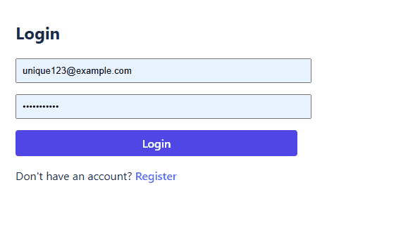

# 🔐 Custom Auth Demo – Serverless JWT Authentication

A minimal, production-ready authentication system using:

- **Backend**: AWS Lambda + DynamoDB + JWT (Serverless Framework)
- **Frontend**: React + Vite
- **Auth Flow**: Register → Login → Access Protected Route

Perfect for learning or as a starter template!



---

## ✨ Features

- ✅ Email/password registration & login
- ✅ JWT-based stateless authentication
- ✅ Protected routes with custom Lambda authorizer
- ✅ CORS-enabled API
- ✅ DynamoDB user storage
- ✅ Local development with `serverless-offline`

---

## 🚀 Quick Start

### Prerequisites

- Node.js 18+
- AWS account (for deployment)
- `serverless` CLI: `npm install -g serverless`

### First-Time Setup (Required!)

You must deploy once to create the DynamoDB table in AWS.
Serverless-offline uses the real AWS table — it does not create local tables.

```
# Deploy to AWS (creates DynamoDB table)
cd backend
npm install
serverless deploy
```

### Run Locally

💡 Local testing note:
The REST API authorizer works perfectly when deployed to AWS.
For local development with serverless-offline, use the React app or test against the deployed endpoint.

1. **Start backend**

   ```bash
   cd backend
   IS_OFFLINE=true npm run offline
   ```

2. **Start frontend**

   ```bash
    cd frontend
    npm install
    npm run dev
   ```

3. **Open http://localhost:5173**

### Test backend

1. Register

```
curl -X POST http://localhost:3000/dev/register \
  -H "Content-Type: application/json" \
  -d '{"email":"user@example.com","password":"securePassword123"}'
```

✅ Success response:

```
{"message":"User registered"}
```

2. Login

```
curl -X POST http://localhost:3000/dev/login   -H "Content: application/json"   -d '{"email":"unique123@example.com","password":"password123"}'
```

✅ Success response:

```
{"accessToken":"eyJhbGciOiJIUzI1NiIsInR5cCI6IkpXVCJ9.xxx"}
```

3. Access protected profile

```
curl -H "Authorization: Bearer YOUR_JWT_TOKEN" http://localhost:3000/dev/profile
```

### Future Enhancements

This demo showcases a minimal JWT authentication system. Planned production-ready improvements include:

1. Secure Token Management
   Access/refresh token rotation with HTTP-only cookies
2. Session Control
   Active session tracking and remote logout
3. Enhanced Security
   Rate limiting, MFA support, and secret management via AWS SSM
4. Password Recovery
   Secure email-based password reset flow
5. Role-Based Access
   Admin/user roles with protected routes
6. Audit Logging
   Login attempt monitoring and suspicious activity alerts
